# チーム開発方法

## Live shareを使ったデモ

### 概要

Live Shareでは複数人でソースを共有し、同時に編集することができます。
ホスト側（開発環境を立ち上げ、招待する側）とゲスト側（参加する側）に分かれ、ホストは自分の環境にゲストを招待します。 
<b>
* ホストはリーダーの人が担当し、対応を行ってください。 
* リーダー以外の人は、ゲストの対応を行ってください。 
</b>

### 招待手順

1. `ホスト`：Live Share起動
2. `ホスト`: url共有
3. `ゲスト`: sessionに参加
4. `ゲスト`: GitHubログイン
5. `ホスト・ゲスト`: Live Share起動確認

#### 1. `ホスト`：Live Share起動

ホスト（招待する人）のpcでCodespace起動後、左下の`Live Share`をクリックします。

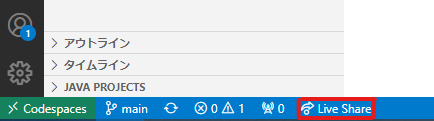

右下に起動中のアナウンス`Starting collaboration session`が表示されています。

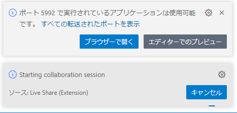

右下に`Invitaion link copied to clipboard! ～`が表示されると準備完了です。

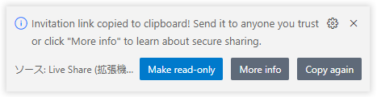

#### 2. `ホスト`: url共有

1の手順終了後、すでにpcには招待用URLがコピーされています。
slackなどに貼り付け、メンバーにURLを共有してください。
（コピーに失敗した場合は`Copy again`をクリックしてください。）

#### 3. `ゲスト`: sessionに参加

ゲスト（参加メンバー）は共有されたURLをクリックすると、ブラウザでVS Codeが立ち上がります。
次のようなポップアップが表示された場合、`Continue in Web`を選択してください。

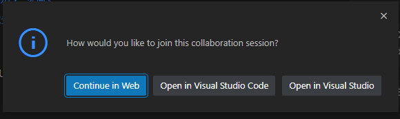

右下に、`Sign in with VS Live Share to a collaboration session.`が表示されるので、
`Sign in` をクリックしてください。

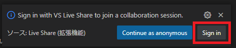

上部にサインインするサービスの選択が現れるので、`GitHub`を選択します。

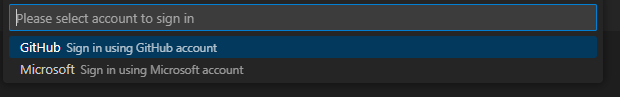

#### 4. `ゲスト`: GitHubログイン

GitHubログイン用のウィンドウが表示されます。
作成したアカウントを入力し、認証に進んでください。

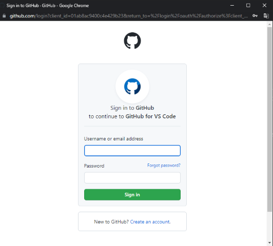

ログイン後、しばらく時間をおいた後にブラウザのVSCodeの準備が完了したら終了です。

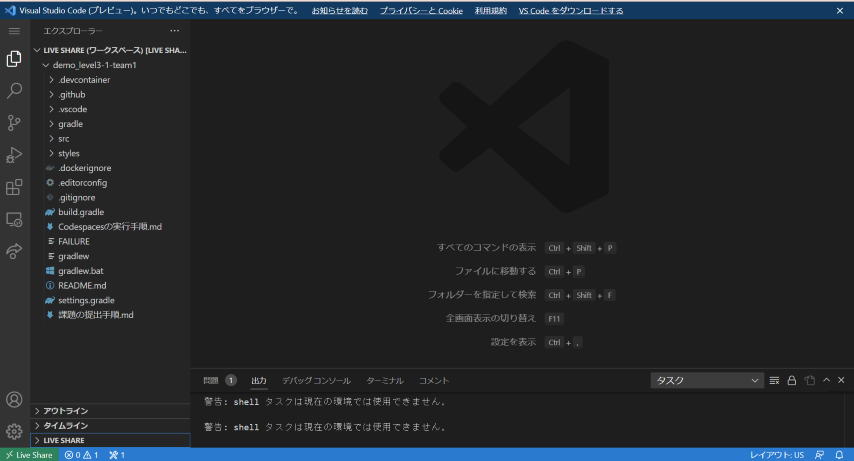

#### 5. `ホスト・ゲスト`: Live Share参加者確認

エクスプローラー（表示されていない場合は左上ファイルボタンをクリック）の下部にLIVE SHAREタブが現れます。
`Participants`に表示されるのが参加中のユーザーです。
全員参加しているか確認してみましょう。

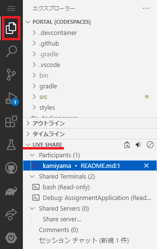

### チーム開発Tips

#### フォロー機能：作業中のメンバーの動きを追いたい場合（ホスト・ゲスト）

Live Shareでは、あるユーザーの開いているファイルや編集中や選択中の箇所を自動で追いかけることができます。

エクスプローラーのLIVE SHAREの`Participants`内で、追いかけたいユーザー名をクリックし、名前左側の丸が塗りつぶされると追跡完了です。
解除したい場合は再度ユーザー名をクリックしてください。

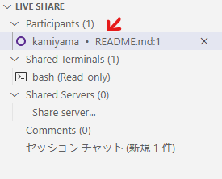 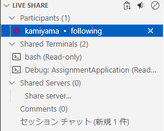

#### 実行したアプリケーションをメンバーで共有したい場合

実行したアプリケーションをメンバーの手元のpcで確認することができます。

1. `ホスト`の人がアプリケーションを実行します。
2. エディター下部の`ポート`を選択します。
3. ポート`8080`の上で右クリックし、`ポートの表示範囲`⇒`Public`を選択します。（画像参考）
4. 起動したアプリケーションのURLをslackなどでメンバーに共有します。

※注意：アプリケーションを停止すると、共有設定も初期化されます。
お手数ですが、アプリケーション再起動の際に再度共有設定をPublicに変更してください。

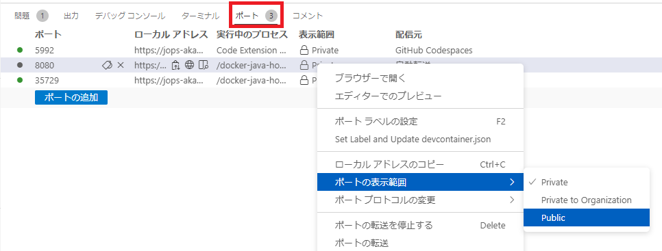

---

## モブプロ実施方法補足

### コミット方法について

#### 概要

今回のモブプロでは各ターム（各順）終了時にソースをコミット(Commit)します。
コミットは、追加・変更したファイルをGitに登録するための操作です。
コミットは`ホスト`の方が行ってください。

#### 作業手順

##### 1. 木の枝のようなマークを押します。

##### 2. これまでに行ったファイルへの変更ないようが表示されています。

変更内容に問題がないか今一度確認しましょう。

##### 3. コミットするファイルを選択しましょう。

コミットしたいファイルの横の＋ボタンを押しましょう。

##### 4. Staged Changesにコミットしたいファイルが含まれていることを確認しましょう。

##### 5. Message欄にCommit Message(コミットメッセージ)を入力しましょう。

* Commit Messageには、今回のコミットの追加・変更内容について記載します。
* ※モブプロでは、**ナビゲーターの名前**を記載してください！

##### 6. チェックボタンを押してコミットしましょう。

---

## モブプロ実践
### LiveShareを使って以下の課題を実施してください
* 練習.txtを以下の流れで更新する
  * ナビゲーターがドライバーに指示を出します。
    * ナビゲーターの好きなもの（食べ物、趣味、アニメ、ゲームなど）を伝える
    * ドライバーはその指示を聞いて練習.txtに入力する
* 入力が終わったら、リーダー（ホスト）はナビゲーターの名前でコミットする
* チームメンバー全員分だけ繰り返し行ってください
* 上記の作業は、リーダー（ホスト）の人が常にLiveShareの共有を使って実施してください
